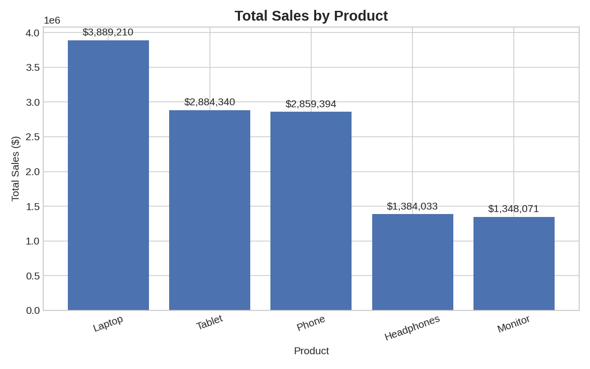
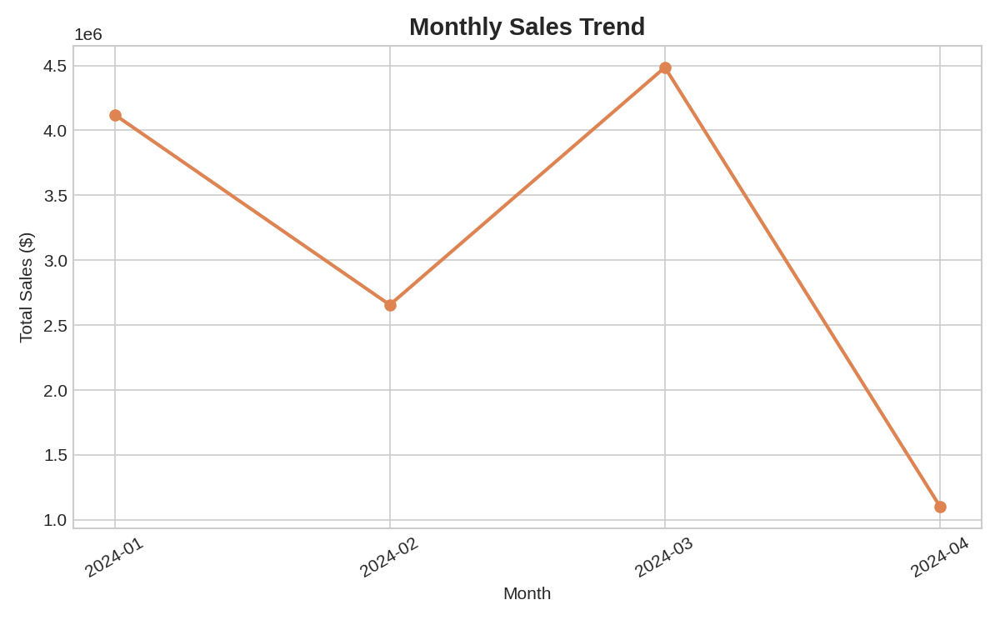
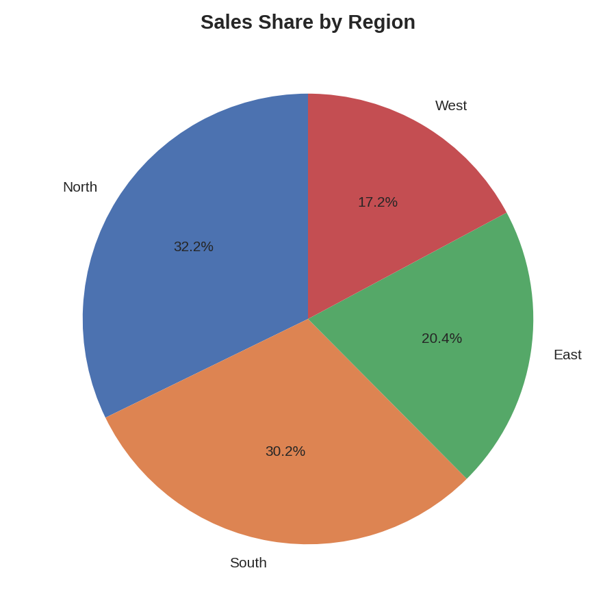

# E-commerce Sales Analysis — Report

## Key Metrics

- **Total Sales:** $12,365,048.00
- **Total Units Sold:** 478
- **Number of Orders:** 100
- **Unique Customers:** 100
- **Average Order Value:** $123,650.48
- **Average Unit Price:** $25,808.51

## Sales by Product

| Product | Total Sales |
|---|---|
| Laptop | $3,889,210.00 |
| Tablet | $2,884,340.00 |
| Phone | $2,859,394.00 |
| Headphones | $1,384,033.00 |
| Monitor | $1,348,071.00 |

## Sales by Region

| Region | Total Sales |
|---|---|
| North | $3,983,635.00 |
| South | $3,737,852.00 |
| East | $2,519,639.00 |
| West | $2,123,922.00 |

## Charts

## Written Insights

1. **Laptop** is the top-selling product by revenue, generating $3,889,210.00 — the strongest candidate for continued stock investment and promotion.

2. **North** is the highest-revenue region, suggesting demand (or marketing reach) is strongest there.

3. Sales peaked in **2024-03** at $4,485,006.00, which is worth cross-checking against any promotions run that month. Note that the final month in the dataset is partial (data ends mid-month), so its lower total reflects fewer days of sales rather than a real decline.

4. The average order value across the dataset is $123,650.48 from 100 orders across 100 unique customers — tracking this over time is a good indicator of upsell/cross-sell effectiveness.
